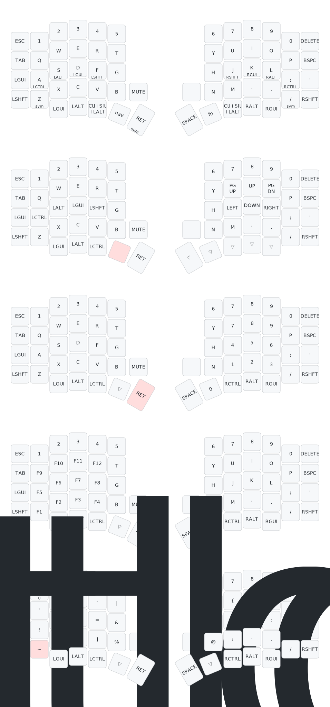

# Sofle V2 Keyboard Guide
Alex's Personal Config

## Default keymap
The default keymap of this keyboard can be found here:

Same hand: You press and hold F, then try to press T with the same hand to type a capital T, but the system doesn't recognize F as Shift, so you get "ft" instead of "T"

Cross hand: You press and hold F with your left hand, then press J with your right hand expecting "J", but the system doesn't recognize F as Shift, so you get "fj" instead of "J"

False positive (unwanted modifier):

Same hand: You try to type "fr" quickly but you hold F slightly too long, so the system interprets F as Shift and you get "R" instead of "fr"

Cross hand: You hold F with left hand slightly too long before pressing J with right hand, resulting in "J" when you wanted "fj"

#### Flashing Order
There is no required order to flash the firmware. You can flash the left or right side first. Assuming that you are attempting to flash the sides with the correct
file (i.e. the right side with the `sofle_right-nice_nano_v2-zmk.uf2` file), you may find it helpful to follow the following order:
1. Confirm both sides of the keyboard are off.
2. Flash the right side of the keyboard, unplug the USB-C cable, and set it aside.
3. Flash the left side of the keyboard, leaving it plugged in after.
4. Turn on the right side of the keyboard. You should see the screen on the Nice!Nano microcontroller light up and display a checkmark next to the wifi icon if the sides have connected.
5. Open you favorite text editor and test the keyboard.

#### Flashing the firmware
1. Connect the keyboard to your computer via USB-C cable.
2. Press the "BOOT" button twice in quick succession to enter bootloader mode.
3. The keyboard should appear as a USB drive on your computer.
4. Drag and drop the `uf2` file that coincides with the side of the keyboard you are flashing onto the USB drive that represents the keyboard.
5. The keyboard will automatically reboot and the new firmware will be flashed.

**Note:** Some operating systems may show a failure when the keyboard reboots, or the USB drive may disappear. This is normal and the keyboard should be flashed successfully.
The keyboard flashing has been confirmed to work successfully on Windows 10, and Linux. 

## Modifying the keymap

### ZMK Keymap
We recommend at least reviewing the [ZMK Keymap documentation](https://zmk.dev/docs/features/keymaps) to understand the structure of the keymap files. This
will help you understand the changes we are making to the generated files. While not required, most example keymaps attempt to show the layout of the keyboard
shown as a comment underneath the layer declaration.

### ZMK Firmware
ZMK does provide an online [keymap editor](https://nickcoutsos.github.io/keymap-editor) and you can use this to change the keymap, this repo is already setup for the use of this editor.

#### Modifying the keymap with the keymap editor

#### Modifying the keymap manually
The exact spacing doesn't matter, but keeping the indentation consistent can be helpful for reading your keymap files. If you indent each button it will be easier
to confirm the structure of the keymap. Take a look at the [default keymap](config/sofle.keymap) to see how this was done. 

The Ergomech Sofle V2 has a 5 way switch on the right side keyboard. The location of the key presses on the 5 way switch are on the last line of the `bindings` section of each layer.
As long as the correct number of entries exist on that row, the 5 way switch will work. 

## Related

- [Keebio Iris Rev 8 (QMK)](https://github.com/apclark31/qmk_userspace) — wired split keyboard with matching home row mods layout
