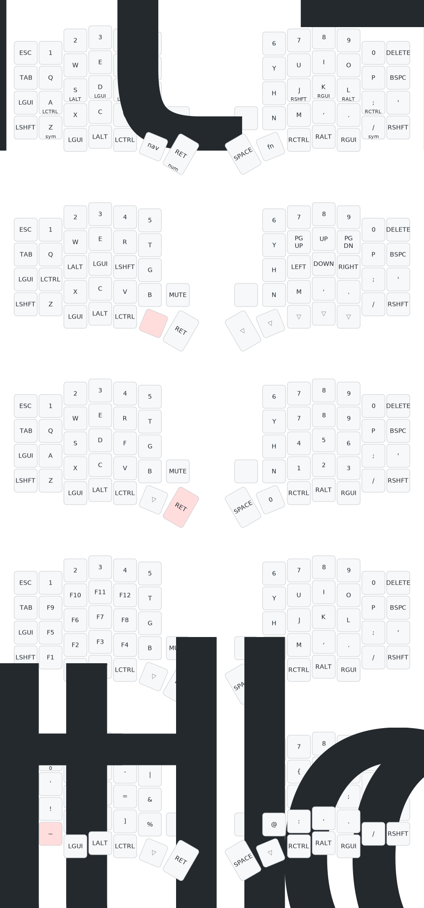

# Sofle V2 Keyboard Guide
Alex's Personal Config

## Default keymap
The default keymap of this keyboard can be found here:

Same hand: You press and hold F, then try to press T with the same hand to type a capital T, but the system doesn't recognize F as Shift, so you get "ft" instead of "T"
Cross hand: You press and hold F with your left hand, then press J with your right hand expecting "J", but the system doesn't recognize F as Shift, so you get "fj" instead of "J"

False positive (unwanted modifier):

Same hand: You try to type "fr" quickly but you hold F slightly too long, so the system interprets F as Shift and you get "R" instead of "fr"
Cross hand: You hold F with left hand slightly too long before pressing J with right hand, resulting in "J" when you wanted "fj"
